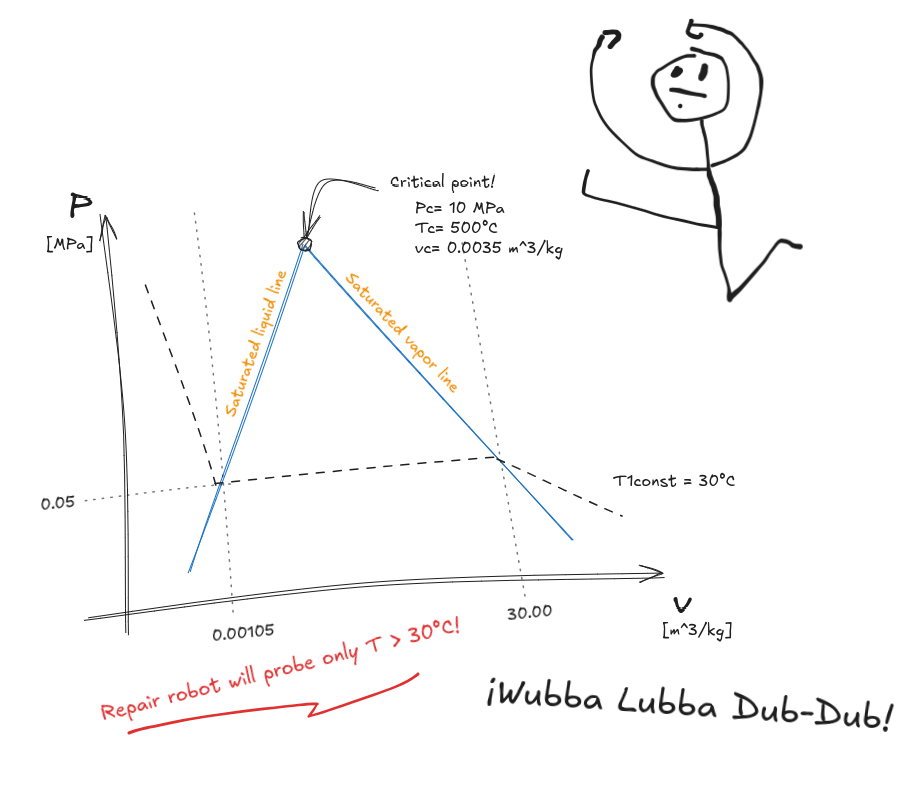

# Año 2315 - Parte 2: Datos Corruptos, el Cambio de Fase y un Cuaderno Garabateado

## Trama:

Un suspiro de alivio escapa de tus labios al ver al robot reparador acoplarse a tu nave. La esperanza se renueva, pero dura poco. Una alarma estridente te saca de tu momentánea tranquilidad. El robot ha detectado una avería crítica: **datos corruptos relacionados con la curva de "saturación y cambio de fase P-v" del fluido hidráulico**. Sin esta información, la nave no puede calibrar sus actuadores y sigue a la deriva.

Una oleada de frustración te invade. ¡Tú eres un programador, no un ingeniero mecánico! Pero la desesperación da paso a la determinación. Siempre has sido bueno resolviendo problemas, y este no será la excepción.

La documentación del robot te da una pista: realizará **10 peticiones HTTP** a la ruta `/phase-change-diagram` para intentar reconstruir el archivo corrupto. Ahí está tu oportunidad.

## Pista:

Mientras buscas frenéticamente entre los manuales de la nave, encuentras el cuaderno de bitácora del ingeniero mecánico. La última entrada termina abruptamente con un *"¡Wubba Lubba Dub-Dub!"* garabateado y una mancha de lo que sospechas es salsa Sichuan...¡Pero entre diagramas a medio terminar y ecuaciones a medio resolver, encuentras la curva de saturación del fluido hidráulico!



> **Nota importante:** El diagrama muestra un punto crítico en P=10 MPa, T=500°C, v=0.0035 m³/kg. El robot solo probará temperaturas superiores a 30°C.

## Ejemplo de una llamada del robot:

**Ruta:** `[GET] /phase-change-diagram?pressure=10`

### Parámetros:

- **pressure**: 10 (en mega pascales)

### Respuesta Esperada:

```json
{
  "specific_volume_liquid": 0.0035,
  "specific_volume_vapor": 0.0035
}
```

## Consideraciones Adicionales:

- La API debe estar programada en Python, TypeScript o Go (se verificará en la entrevista).
- La aplicación puede ser desplegada en cualquier plataforma de tu elección o incluso en tu máquina local (guardamos la URL de la API en la cual se completa el reto).
- Al registrar la URL de tu API, asegúrate de que sea accesible desde el exterior, tendrás tan solo 3 intentos y 5 minutos para que el robot repare el sistema hidráulico (aquí demuestras tu atención al detalle).

## Solución

Registra la URL de tu API aquí: `[POST] /v1/s1/e9/solution`.
¡No olvides consultar la Documentación!

**El destino de la nave y el tuyo dependen de este código. ¡Buena suerte!**